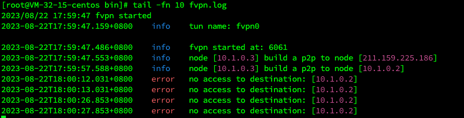

## Install

Download fvpn package from [download](https://tiptopsoft.cn)

## MAC OS & linux

extract files to '/usr/local/bin/'

```shell
tar -xvf fvpn-xxx-fvpn-amd64.tar.gz .
copy linux/amd64/fvpn /usr/local/bin
```

### start:

```shell
fvpn node
```

once if you want to run fvpn daemon on unix like os, use command below:

```shell
fvpn node -d
```

### join network

found a default networkId from [website](https://www.tiptopsoft.cn)
exec:

```shell
fvpn join xxxx(replace your networkId)
```

### Check log

if you run in daemon, a log file named fvpn.log will be generated. contents in it may like:


- as you can see "no access to destination", because you have not joined any network. once we joined a networkId whose
  cidr is "10.0.1.0", network will reach.

Now you can check your device status on [dashboard](https://www.tiptopsoft.cn)

## windows

coming soon
